## Introduction

In this demo, we will explore the capabilities of the **MediaElement** control in a **.NET MAUI** Application. By delving deep into the **MediaElement** control, we'll discover its powerful features.

The **MediaElement** control provides a simple way to play audio and video files. It supports a wide range of media formats, including MP3, WAV, OGG, MPEG, and many others. The control can also be used to play media from URLs or streams.

In addition to basic playback features, the **MediaElement** control provides a number of features, such as the ability to control playback speed, and adjust volume. Developers can also customize the control's appearance and behavior to suit their specific needs.

Overall, the **MediaElement** control is a powerful and flexible tool for adding multimedia capabilities to your cross-platform applications built using **MAUI**.

>:blue_book: The MediaElement control is compatible with a variety of platforms including iOS, Android, Windows, macOS, and Tizen.

By the end of this demo, you will have achieved the following end results:

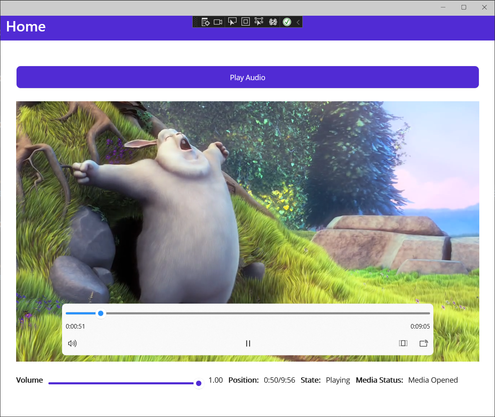  

## Prerequisites

The following prerequisites are needed for this demo.

### .NET 7.0

Download the latest version of the .NET 7.0 SDK [here](https://dotnet.microsoft.com/en-us/download).

### Visual Studio 2022

For this demo, we are going to use the latest version of [Visual Studio 2022](https://visualstudio.microsoft.com/vs/community/).

### Required Workloads

In order to build `.NET MAUI` applications, you need the `.NET Multi-platform App UI development` workload, and in order to build **Blazor** apps, the **ASP.NET and web development** workload needs to be installed, so if you do not have them installed let's do that now.

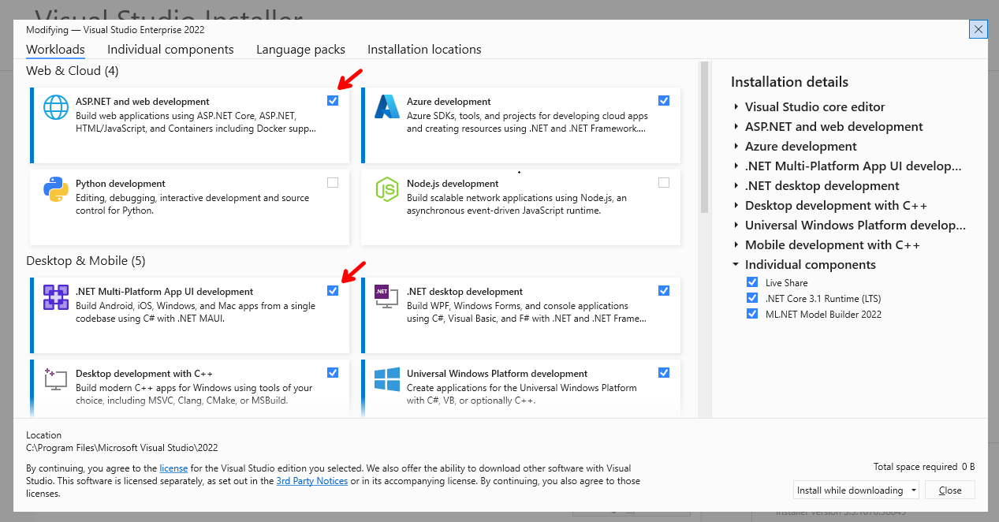  

## Demo

In the following demo we will create a **.NET MAUI Application** and we will cover the main features of the **MediaElement** control, including:

- Playing audio and video files
- Playing media from URLs or embedded files
- Customizing appearance and behavior
- Adjusting volume

### Create a .NET MAUI Application

Before we can explore the features of the MediaElement control in MAUI, we need to create a new MAUI application. To do this, follow these steps:

Create a new **.NET MAUI App** project.

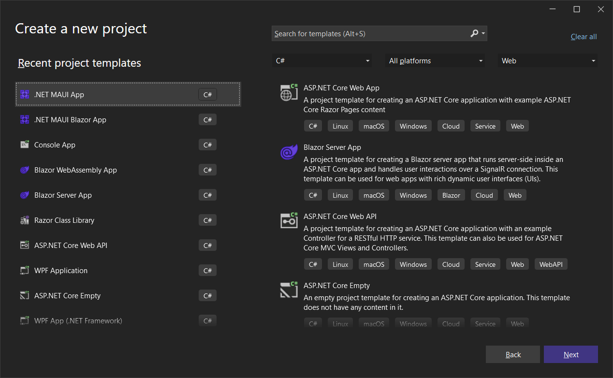  

Name the project **MauiXamlMediaElement** and choose the location where you want to save it, and click **Next**.  

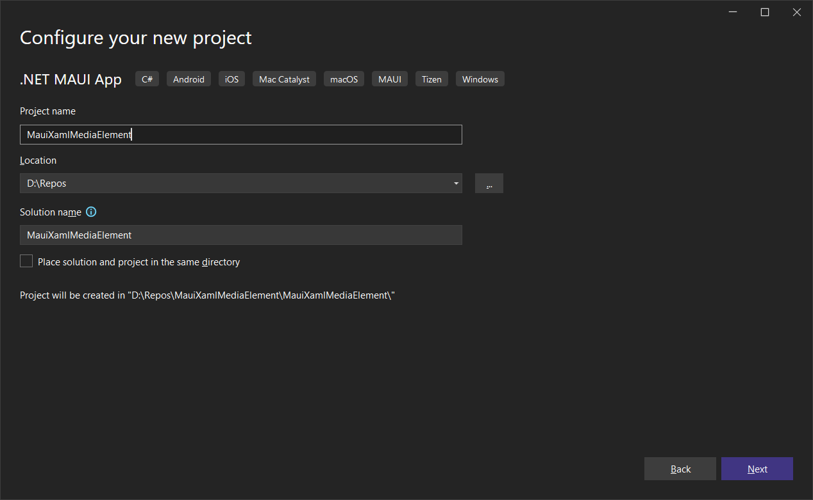

Select **.NET 7.0 (Standard Term Support)** for the **Framework** and click **Create**.

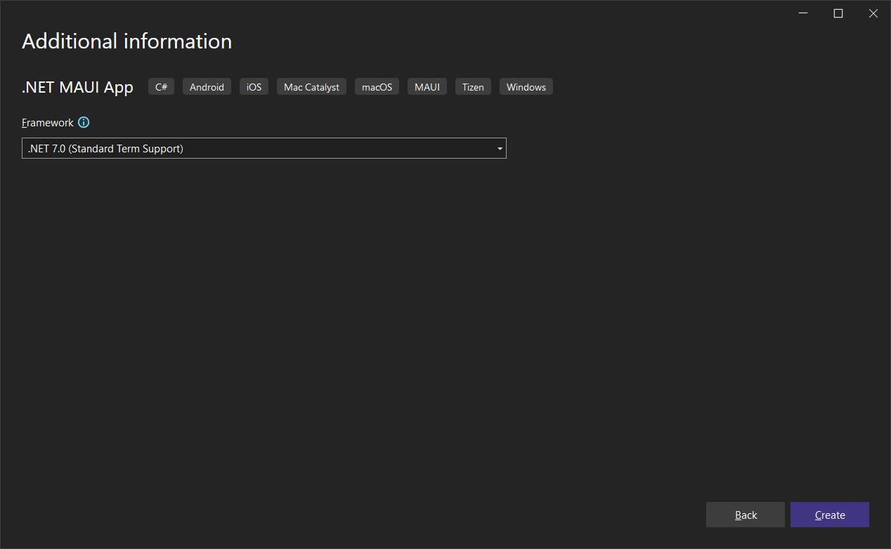

Once your project is created, you'll see the default **MAUI** app with a basic layout.

To add the **MediaElement** control to your layout, you would simply add the following code to your **XAML** file:

```xaml
<MediaElement Source="{URL TO SOURCE LINK}" />
```

To use the **MediaElement** control in your application, you'll need to add the corresponding **NuGet** package. This control is part of the **.NET Multi-platform App UI (.NET MAUI) Community Toolkit**, so the first step is to include the package in your project.

Open the **NuGet Package Console** and run the following command:

```powershell
install-package CommunityToolkit.Maui.MediaElement
```

You will be presented with a *ReadMe.txt* file with instructions on how to enable the **.NET Multi-platform App UI (.NET MAUI) Community Toolkit**. In short, you need to add **.UseMauiCommunityToolkitMediaElement()** to initialize the **.NET MAUI Community Toolkit MediaElement** control in to your **builder** code.

Add **.UseMauiCommunityToolkitMediaElement()** after **.UseMauiApp<App>()**.

Your *MainProgram.cs* file should look like this now:

```csharp
using CommunityToolkit.Maui;
using Microsoft.Extensions.Logging;

namespace MauiXamlMediaElement;

public static class MauiProgram
{
    public static MauiApp CreateMauiApp()
    {
        var builder = MauiApp.CreateBuilder();
        builder
            .UseMauiApp<App>()
            .UseMauiCommunityToolkitMediaElement()
            .ConfigureFonts(fonts =>
            {
                fonts.AddFont("OpenSans-Regular.ttf", "OpenSansRegular");
                fonts.AddFont("OpenSans-Semibold.ttf", "OpenSansSemibold");
            });

#if DEBUG
    builder.Logging.AddDebug();
#endif
        return builder.Build();
    }
}
```

>:blue_book: For more information about the **.NET Multi-platform App UI (.NET MAUI) Community Toolkit** go to https://learn.microsoft.com/en-us/dotnet/communitytoolkit/maui/

Open up *MainPage.xaml* and add the following namespace at the top:

```xaml
xmlns:toolkit="http://schemas.microsoft.com/dotnet/2022/maui/toolkit"
```

Now you can use the toolkit. Let's replace the existing image, labels, and buttons in the *MainPage.xaml* file with the following code:

```xaml
<toolkit:MediaElement x:Name="videoMediaElement"
    ShouldAutoPlay="True"
    Aspect="AspectFill"
    Source="https://commondatastorage.googleapis.com/gtv-videos-bucket/sample/BigBuckBunny.mp4"/>
```

The full *MainPage.xaml* file should look like this:

```xaml
<?xml version="1.0" encoding="utf-8" ?>
<ContentPage xmlns="http://schemas.microsoft.com/dotnet/2021/maui"
             xmlns:x="http://schemas.microsoft.com/winfx/2009/xaml"
              xmlns:toolkit="http://schemas.microsoft.com/dotnet/2022/maui/toolkit"
             x:Class="MauiXamlMediaElement.MainPage">

    <ScrollView>
        <VerticalStackLayout
            Spacing="25"
            Padding="30,0"
            VerticalOptions="Center">

        <toolkit:MediaElement x:Name="videoMediaElement"
            ShouldAutoPlay="True"
            Aspect="AspectFill"
            Source="https://commondatastorage.googleapis.com/gtv-videos-bucket/sample/BigBuckBunny.mp4"/>
        </VerticalStackLayout>
    </ScrollView>

</ContentPage>
```

>:point_up: In the code snippet above, notice that we're configuring the **MediaElement** control by setting three of its properties: **ShouldAutoPlay** property is set to **True**, so that the video starts playing automatically when the application is launched, **Aspect** is set to **AspectFill**. This setting ensures that the video fills the whole area of its parent control, in this case, the screen minus the margins. Lastly, we're setting the **Source** property to the **URL** of the video that we want to play.

Replace *MainPage.xaml.cs* with the following:

```csharp
namespace MauiXamlMediaElement;

public partial class MainPage : ContentPage
{
    public MainPage()
    {
        InitializeComponent();
    }
}
```

Run the application keeping **Windows Machine** as the target, and you should see the *BigBuckBunny.mp4* video playing.

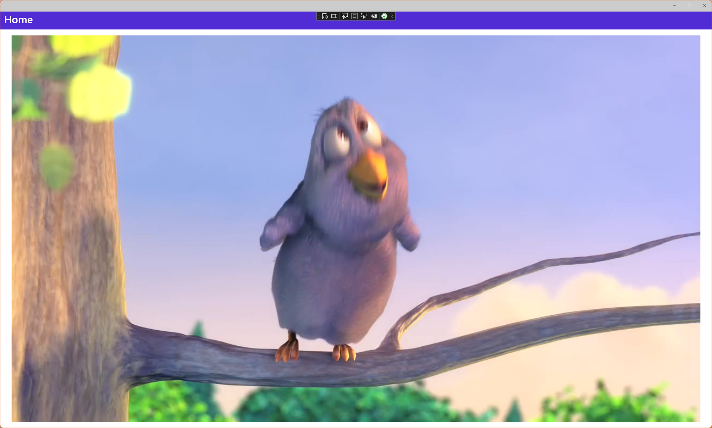  

If you click on the video, you automatically get player controls, which allows you to jump to any position on the video, pause and play, change the volume, change the aspect ratio, and even cast the video to other devices.

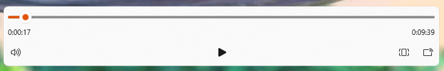  

>:point_up: At the time of creating this tutorial, the features on the player controls, were tested but found to be non-functional. Casting the video to a **TV** or **Bluetooth** headset, and changing the aspect ratio did not work. 

Notice that the application also works on **Android**:

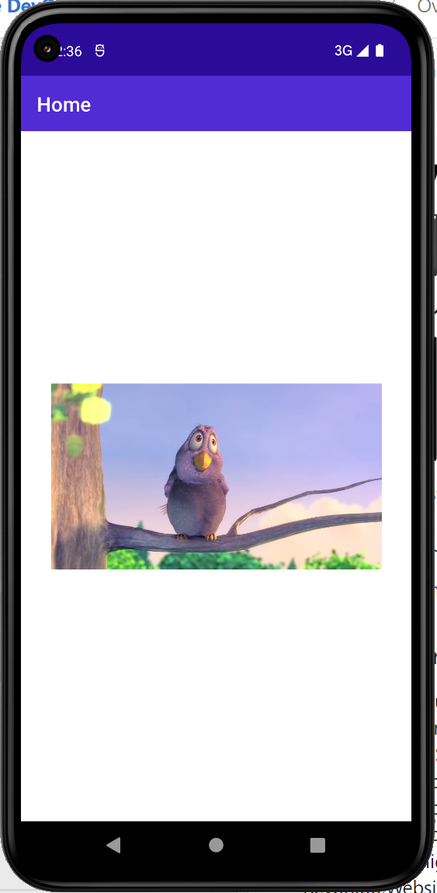  

The **Android** player only shows the ability to pause and play, and to jump to any position on the video.

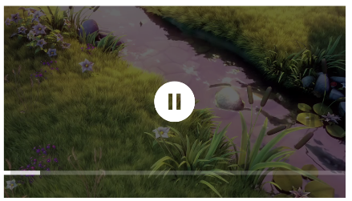  

>:blue_book: You can hide the player controls from the users by setting the **ShouldShowPlaybackControls** property to **False**.

Now, we are going to add an **MP3** audio file to the solution and play it from a button click.

Go to the *Platforms/Resources/Raw* folder, right-click on it, and click on the **Add/Existing Item...** option, and select an audio file. If you want to use the one I used, download it from the repo.

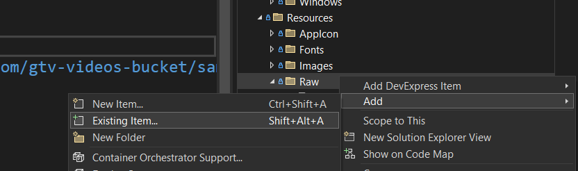  

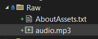  

Add the following markup before the video `MediaElement`:

```xaml
<Button Text="Play Audio" Clicked="Button_Clicked" />

<toolkit:MediaElement x:Name="audioMediaElement"
                      IsVisible="False"
                      Source="embed://audio.mp3"
                      ShouldShowPlaybackControls="True"
                      />
```

The complete *MainPage.xaml* file should look like this:

```xaml
<?xml version="1.0" encoding="utf-8" ?>
<ContentPage xmlns="http://schemas.microsoft.com/dotnet/2021/maui"
             xmlns:x="http://schemas.microsoft.com/winfx/2009/xaml"
             xmlns:toolkit="http://schemas.microsoft.com/dotnet/2022/maui/toolkit"
             x:Class="MauiXamlMediaElement.MainPage">

    <ScrollView>
        <VerticalStackLayout Spacing="25"
                             Padding="30,0"
                             VerticalOptions="Center">
            <Button Text="Play Audio" Clicked="Button_Clicked" />

            <toolkit:MediaElement x:Name="audioMediaElement"
                                  IsVisible="False"
                                  Source="embed://audio.mp3"
                                  ShouldShowPlaybackControls="True"
                                  />

            <toolkit:MediaElement x:Name="videoMediaElement"
                                  IsVisible="True"
                                  ShouldAutoPlay="True"
                                  Aspect="AspectFill"
                                  Source="https://commondatastorage.googleapis.com/gtv-videos-bucket/sample/BigBuckBunny.mp4" 
                                  />
        </VerticalStackLayout>
    </ScrollView>

</ContentPage>
```

Replace *MainPage.xaml.cs* file with the following:

```csharp
namespace MauiXamlMediaElement;

public partial class MainPage : ContentPage
{
    public MainPage()
    {
        InitializeComponent();
    }

    private void Button_Clicked(object sender, EventArgs e)
    {
        audioMediaElement.Play();
    }
}
```

Run the application on **Windows**. The video starts playing. You can play the embedded audio file by clicking the **Play Audio** button.

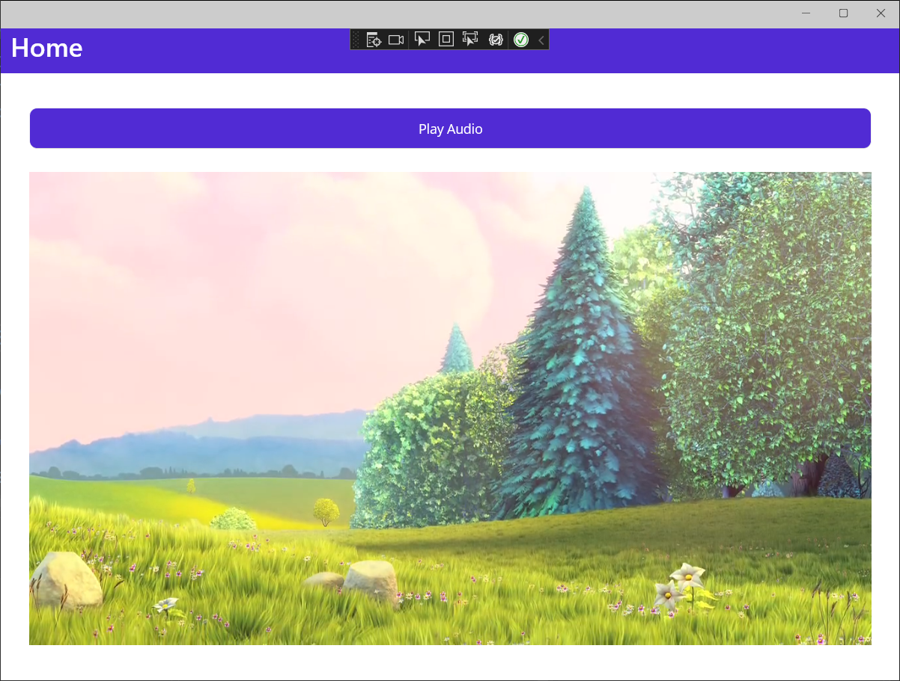

Finally let's add the ability to control the volume of the video, but modifying the **MediaElement's** volume property with a **Slider**.

Go to the *MainPage.xaml* file and add the following code below the **videoMediaElement**.

```xaml
<HorizontalStackLayout x:Name="volumeControl"
           IsVisible="True">

    <Label Text="Volume" />

    <Slider Maximum="1.0"
        Minimum="0.0"
        Margin="10,0,0,0"
        Value="{Binding Volume}"
        WidthRequest="300" />

</HorizontalStackLayout>
```

The complete file should look like this: 

```xaml
<?xml version="1.0" encoding="utf-8" ?>
<ContentPage xmlns="http://schemas.microsoft.com/dotnet/2021/maui"
             xmlns:x="http://schemas.microsoft.com/winfx/2009/xaml"
             xmlns:toolkit="http://schemas.microsoft.com/dotnet/2022/maui/toolkit"
             x:Class="MauiXamlMediaElement.MainPage">

    <ScrollView>
        <VerticalStackLayout Spacing="25"
                             Padding="30,0"
                             VerticalOptions="Center">

            <Button Text="Play Audio" Clicked="Button_Clicked" />

            <toolkit:MediaElement x:Name="audioMediaElement"
                                  IsVisible="False"
                                  Source="embed://audio.mp3"
                                  ShouldShowPlaybackControls="True"
                                  />

            <toolkit:MediaElement x:Name="videoMediaElement"
                                  IsVisible="True"
                                  ShouldAutoPlay="True"
                                  Aspect="AspectFill"
                                  Source="https://commondatastorage.googleapis.com/gtv-videos-bucket/sample/BigBuckBunny.mp4" 
                                  />

            <HorizontalStackLayout x:Name="volumeControl"
                                   IsVisible="True">
                <Label Text="Volume" />

                <Slider Maximum="1.0"
                        Minimum="0.0"
                        Margin="10,0,0,0"
                        Value="{Binding Volume}"
                        WidthRequest="300" />
            </HorizontalStackLayout>

        </VerticalStackLayout>
    </ScrollView>

</ContentPage>
```

Replace *MainPage.xaml.cs* with the following:

```csharp
namespace MauiXamlMediaElement;

public partial class MainPage : ContentPage
{
    public double Volume
    {
        get
        {
            if (videoMediaElement != null)
            {
                return videoMediaElement.Volume;
            }
            else return 1;
        }
        set
        {
            bool setFlag = false;
            if (videoMediaElement != null && videoMediaElement.Volume != value)
            {
                videoMediaElement.Volume = value;
                setFlag = true;
            }
            if (audioMediaElement != null && audioMediaElement.Volume != value)
            {
                audioMediaElement.Volume = value;
                setFlag = true;
            }
            if (setFlag)
                OnPropertyChanged(nameof(Volume));
        }
    }

    public MainPage()
    {
        BindingContext = this;
        InitializeComponent();
    }

    private void Button_Clicked(object sender, EventArgs e)
    {
        audioMediaElement.Play();
    }
}
```

Run the application. You can change the volume for both audio and video using the **Slider**.

 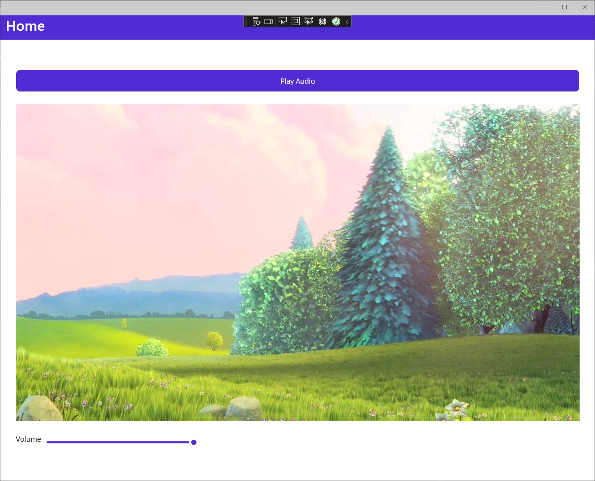

#### Add Volume and Position Indicators

First, we're going to need code to format a `TimeSpan` to a string that makes sense for UI. Add the following class to the project:

*Extensions.cs*:

```c#
public static class Extensions
{
    public static string ToShortTimeString(this TimeSpan t)
    {
        string ret = "";
        if (t.Hours > 0)
            ret = $"{t.Hours}:";

        if (t.TotalMinutes > 0)
        {
            if (t.Hours == 0)
                ret += $"{t.Minutes}:";
            else
                ret += $"{t.Minutes.ToString("D2")}:";
        }

        if (t.TotalSeconds > 0)
            ret += $"{t.Seconds.ToString("D2")}";
        else
            ret += "00";

        return ret;
    }
}
```

Replace *MainPage.xaml* with the following:

```xml
<?xml version="1.0" encoding="utf-8" ?>
<ContentPage xmlns="http://schemas.microsoft.com/dotnet/2021/maui"
             xmlns:x="http://schemas.microsoft.com/winfx/2009/xaml"
             xmlns:toolkit="http://schemas.microsoft.com/dotnet/2022/maui/toolkit"
             x:Class="MauiXamlMediaElement.MainPage">

    <ScrollView>
        <VerticalStackLayout
            Spacing="25"
            Padding="30,0"
            VerticalOptions="Center">

            <Button Text="Play Audio" Clicked="Button_Clicked" />

            <toolkit:MediaElement x:Name="audioMediaElement"
                      IsVisible="False"
                      Source="embed://audio.mp3"
                      ShouldShowPlaybackControls="True"
                      />

            <toolkit:MediaElement x:Name="videoMediaElement"
                Loaded="videoMediaElement_Loaded"
                ShouldAutoPlay="True"
                Aspect="AspectFill"
                Source="https://commondatastorage.googleapis.com/gtv-videos-bucket/sample/BigBuckBunny.mp4"/>

            <HorizontalStackLayout x:Name="volumeControl"
                       IsVisible="True">

                <Label FontAttributes="Bold"  Text="Volume" />

                <Slider Maximum="1.0"
                    Minimum="0.0"
                    Margin="10,0,10,0"
                    Value="{Binding Volume}"
                    WidthRequest="300" />

                <Label Text="{Binding Volume, StringFormat='{0:F2}'}" />

                <Label FontAttributes="Bold" Text="Position:"
                       Margin="10,0,10,0"/>
                
                <Label Text="{Binding Position}" />

            </HorizontalStackLayout>

        </VerticalStackLayout>
    </ScrollView>

</ContentPage>
```

Note that we are specifying a `Loaded` event handler. This is because when the app loads, the `MediaElement` needs to initialize. When it's ready for you to access, the `Loaded` event occurs. Until that happens, the component doesn't exist, and you can't reference it.

In the code behind, we'll use that handler to hook another event, `PositionChanged`, which we will use to update the Position in real time.

Replace *MainPage.xaml.cs* with the following:

```c#
using CommunityToolkit.Maui.Core.Primitives;
namespace MauiXamlMediaElement;

public partial class MainPage : ContentPage
{
    public string Position
    {
        get
        {
            if (videoMediaElement != null)
            {
                var pos = videoMediaElement.Position;
                var dur = videoMediaElement.Duration;
                // Using a TimeSpan extension method
                return pos.ToShortTimeString() + "/" + dur.ToShortTimeString();
            }
            else
                return "";
        }
    }

    public double Volume
    {
        get
        {
            if (videoMediaElement != null)
            {
                return videoMediaElement.Volume;
            }
            else return 1;
        }
        set
        {
            bool setFlag = false;
            if (videoMediaElement != null && videoMediaElement.Volume != value)
            {
                videoMediaElement.Volume = value;
                setFlag = true;
            }
            if (audioMediaElement != null && audioMediaElement.Volume != value)
            {
                audioMediaElement.Volume = value;
                setFlag = true;
            }
            if (setFlag)
                OnPropertyChanged(nameof(Volume));
        }
    }

    public MainPage()
    {
        BindingContext = this;

        InitializeComponent();
    }

    private void VideoMediaElement_PositionChanged(object sender, MediaPositionChangedEventArgs e)
    {
        OnPropertyChanged(nameof(Position));
    }

    private void Button_Clicked(object sender, EventArgs e)
    {
        audioMediaElement.Play();
    }

    private void videoMediaElement_Loaded(object sender, EventArgs e)
    {
        videoMediaElement.PositionChanged +=
            VideoMediaElement_PositionChanged;
    }
}
```

In the `Loaded` event we're hooking the `PositionChanged` event, where we simply tell the UI that our `Position` string property has changed:

```c#
private void VideoMediaElement_PositionChanged(object sender,
    MediaPositionChangedEventArgs e)
{
    OnPropertyChanged(nameof(Position));
}
```

`Position` is a read-only string property that returns a nicely formatted string that we can return on demand:

```c#
public string Position
{
    get
    {
        if (videoMediaElement != null)
        {
            var pos = videoMediaElement.Position;
            var dur = videoMediaElement.Duration;
            // Using a TimeSpan extension method
            return pos.ToShortTimeString() + "/" 
                + dur.ToShortTimeString();
        }
        else
            return "";
    }
}
```

Note that we're calling our `TimeSpan` extension method, `ToShortTimeString()` which does a decent job of returning an efficient string representation of the time.

Run the app, and notice that the Volume and Position are updated in real time:

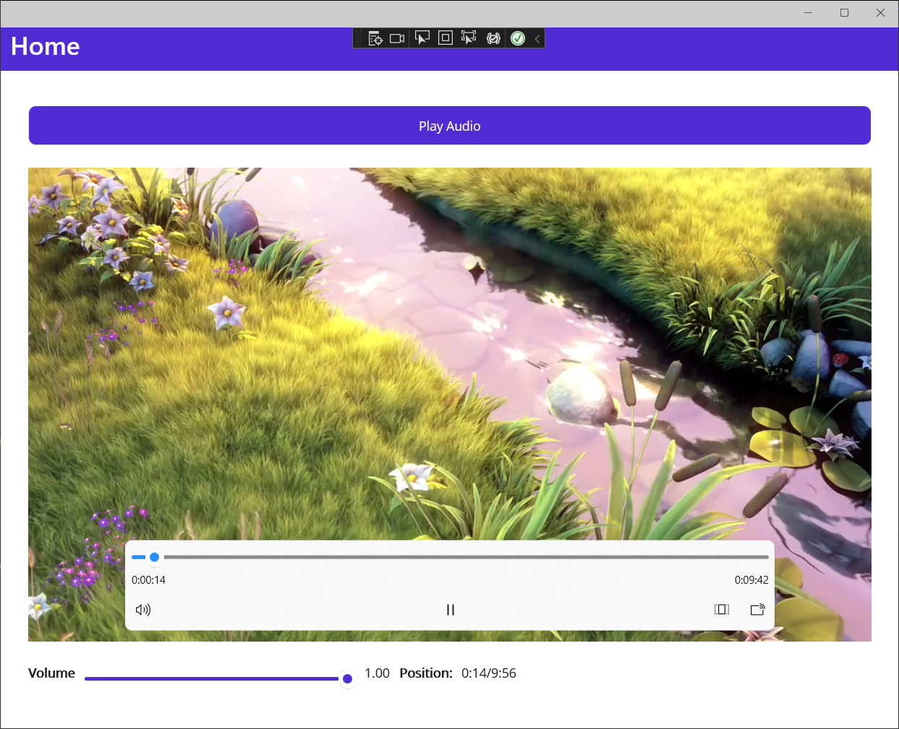

#### Other Events

You've already seen that we can use the Loaded event to do further initialization. Now, let's look at some other events we can handle.

##### CurrentState

Replace *MainPage.xaml.cs* with the following:

```c#
using CommunityToolkit.Maui.Core.Primitives;
namespace MauiXamlMediaElement;

public partial class MainPage : ContentPage
{
    public string State
    {
        get
        {
            if (videoMediaElement != null)
            {
                return Enum.GetName(typeof(MediaElementState), videoMediaElement.CurrentState);
            }
            else
                return "";
        }
    }

    public string Position
    {
        get
        {
            if (videoMediaElement != null)
            {
                var pos = videoMediaElement.Position;
                var dur = videoMediaElement.Duration;
                // Using a TimeSpan extension method
                return pos.ToShortTimeString() + "/" + dur.ToShortTimeString();
            }
            else
                return "";
        }
    }

    public double Volume
    {
        get
        {
            if (videoMediaElement != null)
            {
                return videoMediaElement.Volume;
            }
            else return 1;
        }
        set
        {
            bool setFlag = false;
            if (videoMediaElement != null && videoMediaElement.Volume != value)
            {
                videoMediaElement.Volume = value;
                setFlag = true;
            }
            if (audioMediaElement != null && audioMediaElement.Volume != value)
            {
                audioMediaElement.Volume = value;
                setFlag = true;
            }
            if (setFlag)
                OnPropertyChanged(nameof(Volume));
        }
    }

    public MainPage()
    {
        BindingContext = this;

        InitializeComponent();
    }

    private void VideoMediaElement_PositionChanged(object sender, MediaPositionChangedEventArgs e)
    {
        OnPropertyChanged(nameof(Position));
    }

    private void Button_Clicked(object sender, EventArgs e)
    {
        audioMediaElement.Play();
    }

    private void VideoMediaElement_StateChanged(object sender, MediaStateChangedEventArgs e)
    {
        OnPropertyChanged(nameof(State));
    }

    private void videoMediaElement_Loaded(object sender, EventArgs e)
    {
        videoMediaElement.PositionChanged +=
            VideoMediaElement_PositionChanged;

        videoMediaElement.StateChanged += 
            VideoMediaElement_StateChanged;
    }

}
```

We added a handler for the `StateChanged` event, and also a read-only string property called `State`:

```c#
public string State
{
    get
    {
        if (videoMediaElement != null)
        {
            return Enum.GetName(typeof(MediaElementState),
                 videoMediaElement.CurrentState);
        }
        else
            return "";
    }
}
```

Just as with the position, in the `StateChanged` handler, we just tell the UI to rebind the `State` property.

```c#
private void VideoMediaElement_StateChanged(object sender, 
  MediaStateChangedEventArgs e)
{
    OnPropertyChanged(nameof(State));
}
```

In *MainPage.xaml*, add the following markup at line 45, just after the markup to show the position:

```xaml
<Label FontAttributes="Bold" Text="State:"
       Margin="10,0,10,0"/>

<Label Text="{Binding State}" />
```

Run the app, and you'll see that the state label changes when you pause, resume, stop, etc.

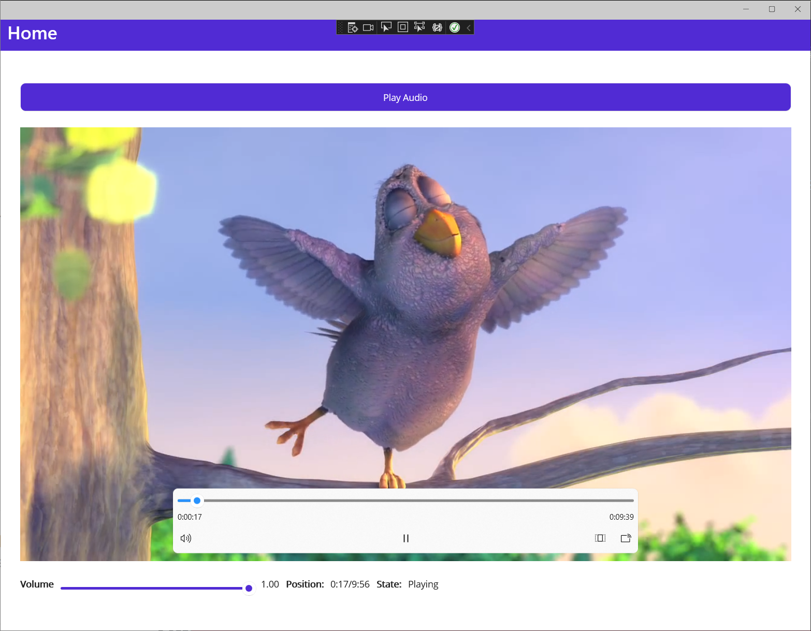

##### Media Status Events

There are three media-related events you can handle, not so much for reporting to the user, but for you to act on in your code.

| Event       | Description                                                    |
| :---------- | :------------------------------------------------------------- |
| MediaOpened | Occurs when the media stream has been validated and opened.    |
| MediaEnded  | Occurs when the `MediaElement` finishes playing its media.     |
| MediaFailed | Occurs when there's an error associated with the media source. |

Let's create a `MediaStatus` string property, and update it from these three event handlers.

Replace *MainPage.xaml* with the following:

```xaml
<?xml version="1.0" encoding="utf-8" ?>
<ContentPage xmlns="http://schemas.microsoft.com/dotnet/2021/maui"
             xmlns:x="http://schemas.microsoft.com/winfx/2009/xaml"
             xmlns:toolkit="http://schemas.microsoft.com/dotnet/2022/maui/toolkit"
             x:Class="MauiXamlMediaElement.MainPage">

    <ScrollView>
        <VerticalStackLayout
            Spacing="25"
            Padding="30,0"
            VerticalOptions="Center">

            <Button Text="Play Audio" Clicked="Button_Clicked" />

            <toolkit:MediaElement x:Name="audioMediaElement"
                      IsVisible="False"
                      Source="embed://audio.mp3"
                      ShouldShowPlaybackControls="True"
                      />

            <toolkit:MediaElement x:Name="videoMediaElement"
                Loaded="videoMediaElement_Loaded"
                ShouldAutoPlay="True"
                Aspect="AspectFill"
                Source="https://commondatastorage.googleapis.com/gtv-videos-bucket/sample/BigBuckBunny.mp4"/>

            <HorizontalStackLayout x:Name="volumeControl"
                       IsVisible="True">

                <Label FontAttributes="Bold"  Text="Volume" />

                <Slider Maximum="1.0"
                    Minimum="0.0"
                    Margin="10,0,10,0"
                    Value="{Binding Volume}"
                    WidthRequest="300" />

                <Label Text="{Binding Volume, StringFormat='{0:F2}'}" />

                <Label FontAttributes="Bold" Text="Position:"
                       Margin="10,0,10,0"/>

                <Label Text="{Binding Position}" />

                <Label FontAttributes="Bold" Text="State:"
                       Margin="10,0,10,0"/>

                <Label Text="{Binding State}" />

                <Label FontAttributes="Bold" Text="Media Status:"
                       Margin="10,0,10,0"/>

                <Label Text="{Binding MediaStatus}" />

            </HorizontalStackLayout>

        </VerticalStackLayout>
    </ScrollView>

</ContentPage>
```

Replace *MainPage.xaml.cs* with the following:

```c#
using CommunityToolkit.Maui.Core.Primitives;
namespace MauiXamlMediaElement;

public partial class MainPage : ContentPage
{
    private string mediaStatus = string.Empty;
    public string MediaStatus
    {
        get => mediaStatus; 
        private set
        {
            mediaStatus = value;
            OnPropertyChanged(nameof(MediaStatus));
        }
    }

    public string State
    {
        get
        {
            if (videoMediaElement != null)
            {
                return Enum.GetName(typeof(MediaElementState), videoMediaElement.CurrentState);
            }
            else
                return "";
        }
    }

    public string Position
    {
        get
        {
            if (videoMediaElement != null)
            {
                var pos = videoMediaElement.Position;
                var dur = videoMediaElement.Duration;
                // Using a TimeSpan extension method
                return pos.ToShortTimeString() + "/" + dur.ToShortTimeString();
            }
            else
                return "";
        }
    }

    public double Volume
    {
        get
        {
            if (videoMediaElement != null)
            {
                return videoMediaElement.Volume;
            }
            else return 1;
        }
        set
        {
            bool setFlag = false;
            if (videoMediaElement != null && videoMediaElement.Volume != value)
            {
                videoMediaElement.Volume = value;
                setFlag = true;
            }
            if (audioMediaElement != null && audioMediaElement.Volume != value)
            {
                audioMediaElement.Volume = value;
                setFlag = true;
            }
            if (setFlag)
                OnPropertyChanged(nameof(Volume));
        }
    }

    public MainPage()
    {
        BindingContext = this;

        InitializeComponent();
    }

    private void VideoMediaElement_PositionChanged(object sender, MediaPositionChangedEventArgs e)
    {
        OnPropertyChanged(nameof(Position));
    }

    private void Button_Clicked(object sender, EventArgs e)
    {
        audioMediaElement.Play();
    }

    private void VideoMediaElement_StateChanged(object sender, MediaStateChangedEventArgs e)
    {
        OnPropertyChanged(nameof(State));
    }

    private void videoMediaElement_Loaded(object sender, EventArgs e)
    {
        videoMediaElement.PositionChanged +=
            VideoMediaElement_PositionChanged;

        videoMediaElement.StateChanged +=
            VideoMediaElement_StateChanged;

        videoMediaElement.MediaOpened
            += VideoMediaElement_MediaOpened;

        videoMediaElement.MediaEnded
            += VideoMediaElement_MediaEnded;

        videoMediaElement.MediaFailed
            += VideoMediaElement_MediaFailed;
    }

    private void VideoMediaElement_MediaFailed(object sender, MediaFailedEventArgs e)
    {
        MediaStatus = "Media Failed";
    }

    private void VideoMediaElement_MediaEnded(object sender, EventArgs e)
    {
        MediaStatus = "Media Ended";
    }

    private void VideoMediaElement_MediaOpened(object sender, EventArgs e)
    {
        MediaStatus = "Media Opened";
    }
}
```

Run the app. Scrub the position almost to the end. Notice that the `MediaStatus` changes.

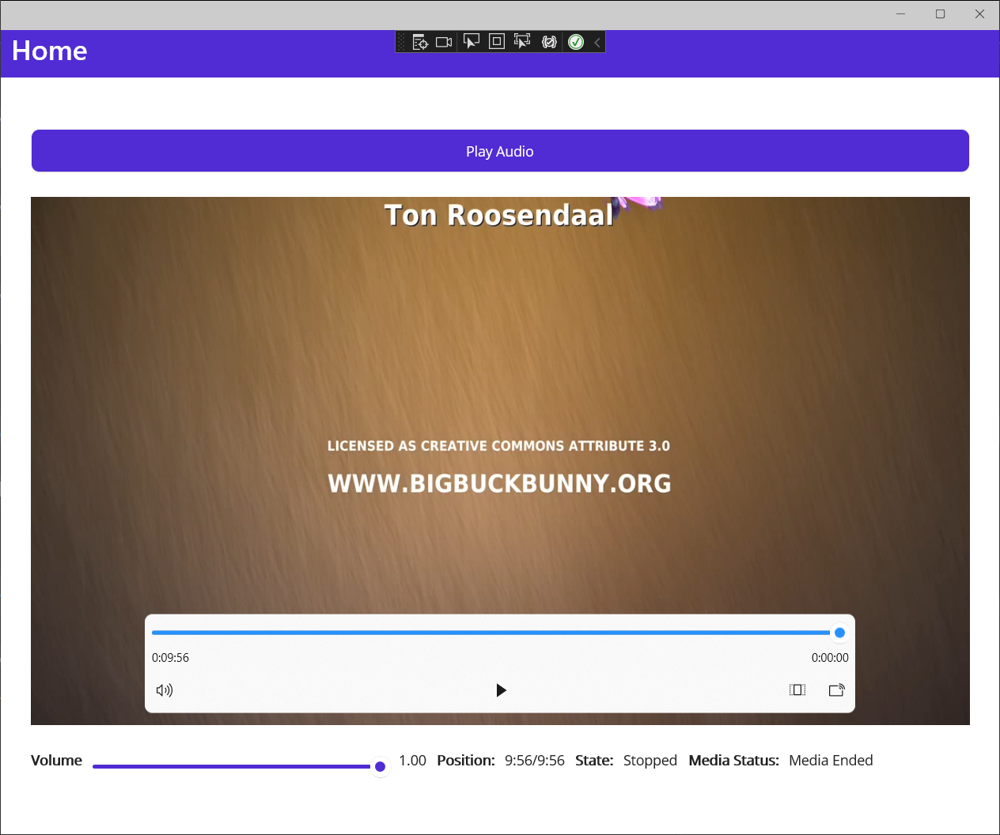

## Using MediaElement in a MAUI Blazor App

If you're thinking you can add MAUI Xaml components to a MAUI Blazor page (or component), stop thinking. You can't, at least not as of this writing.

What you **CAN** do, however, is add a XAML page (containing `MediaElement` or other XAML controls) to a MAUI Blazor app and navigate to that page and back. 

I learned this technique from Gerald Versluis' excellent YouTube Tutorial, [3 Ways [to] Combine .NET MAUI and .NET MAUI Blazor Hybrid](https://www.youtube.com/watch?v=2dllz4NZC0I). You should do yourself a favor and subscribe to his YouTube channel. 

Create a new **.NET MAUI Blazor App** Project

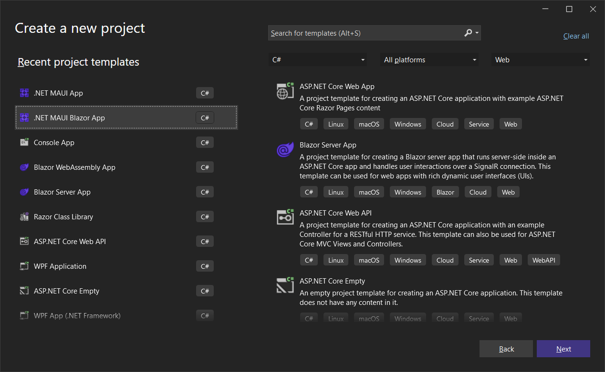

Name the project **MauiBlazorMediaElement** and choose the location where you want to save it, and click **Next**.  

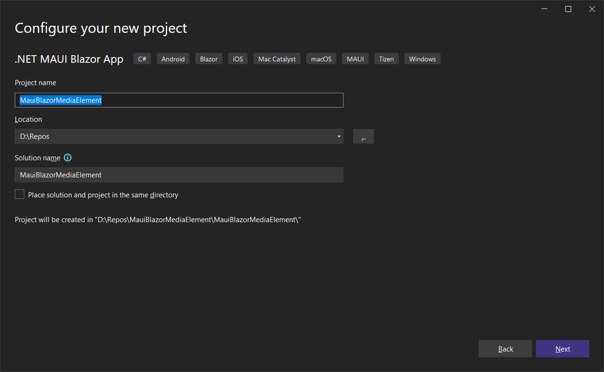

Select **.NET 7.0 (Standard Term Support)** for the **Framework** and click **Create**.

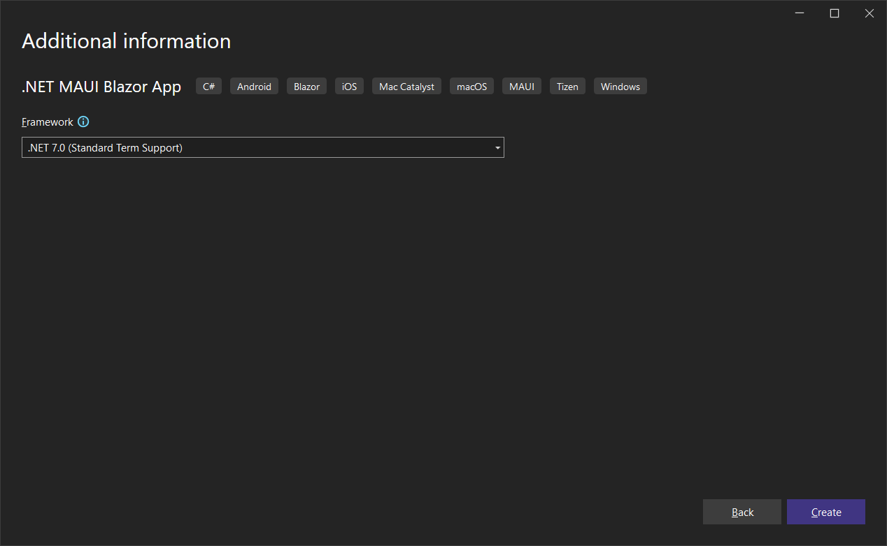

As before, open the **NuGet Package Console** and run the following command:

```powershell
install-package CommunityToolkit.Maui.MediaElement
```

In *MauiProgram.cs*, add **.UseMauiCommunityToolkitMediaElement()** after **.UseMauiApp<`App`>()**.

Your *MainProgram.cs* file should look like this now:

```c#
using Microsoft.Extensions.Logging;
using MauiBlazorMediaElement.Data;
using CommunityToolkit.Maui;

namespace MauiBlazorMediaElement;

public static class MauiProgram
{
    public static MauiApp CreateMauiApp()
    {
        var builder = MauiApp.CreateBuilder();
        builder
            .UseMauiApp<App>()
            .UseMauiCommunityToolkitMediaElement()
            .ConfigureFonts(fonts =>
            {
                fonts.AddFont("OpenSans-Regular.ttf", "OpenSansRegular");
            });

        builder.Services.AddMauiBlazorWebView();

#if DEBUG
        builder.Services.AddBlazorWebViewDeveloperTools();
        builder.Logging.AddDebug();
#endif

        builder.Services.AddSingleton<WeatherForecastService>();

        return builder.Build();
    }
}
```

###### Add Audio Resource

Add the *audio.mp3* file to your *Resources/Raw* folder 

Next, add a new XAML page called *MediaPage.xaml* to the project, and include a code behind:

*MediaPage.xaml*:

```xaml
<?xml version="1.0" encoding="utf-8" ?>
<ContentPage xmlns="http://schemas.microsoft.com/dotnet/2021/maui"
             xmlns:x="http://schemas.microsoft.com/winfx/2009/xaml"
             xmlns:toolkit="http://schemas.microsoft.com/dotnet/2022/maui/toolkit"
             x:Class="MauiBlazorMediaElement.MediaPage">

    <ScrollView>
        <VerticalStackLayout
            Spacing="25"
            Padding="30,0"
            VerticalOptions="Center">

            <HorizontalStackLayout>
                <Button Text="Go Back" Clicked="BackButton_Clicked" />
                <Button Text="Play Audio" Clicked="Button_Clicked" />
            </HorizontalStackLayout>

            <toolkit:MediaElement x:Name="audioMediaElement"
                      IsVisible="False"
                      Source="embed://audio.mp3"
                      ShouldShowPlaybackControls="True"
                      />

            <toolkit:MediaElement x:Name="videoMediaElement"
                Loaded="videoMediaElement_Loaded"
                ShouldAutoPlay="True"
                Aspect="AspectFill"
                Source="https://commondatastorage.googleapis.com/gtv-videos-bucket/sample/BigBuckBunny.mp4"/>

            <HorizontalStackLayout x:Name="volumeControl"
                       IsVisible="True">

                <Label TextColor="Black" FontAttributes="Bold"  Text="Volume" />

                <Slider Maximum="1.0"
                    Minimum="0.0"
                    Margin="10,0,10,0"
                    Value="{Binding Volume}"
                    WidthRequest="300" />

                <Label TextColor="Black" Text="{Binding Volume, StringFormat='{0:F2}'}" />

                <Label FontAttributes="Bold" Text="Position:"
                       Margin="10,0,10,0"/>

                <Label TextColor="Black" Text="{Binding Position}" />

                <Label TextColor="Black" FontAttributes="Bold" Text="State:"
                       Margin="10,0,10,0"/>

                <Label TextColor="Black" Text="{Binding State}" />

                <Label TextColor="Black" FontAttributes="Bold" Text="Media Status:"
                       Margin="10,0,10,0"/>

                <Label TextColor="Black" Text="{Binding MediaStatus}" />

            </HorizontalStackLayout>

        </VerticalStackLayout>
    </ScrollView>

</ContentPage>
```

Notice that this is almost exactly the same page as we created in the **MauiXamlMediaElement** project. except for a few changes.

I've changed the class name on line 5:

```c#
x:Class="MauiBlazorMediaElement.MediaPage"
```

I added a **Go Back** button to return to the Blazor content.

I also did a quick fix to a styling issue by setting the `TextColor` property to all the `Label` controls to "Black". They don't show up otherwise.

*MainPage.xaml.cs*:

```c#
using CommunityToolkit.Maui.Core.Primitives;

namespace MauiBlazorMediaElement;

public partial class MediaPage : ContentPage
{
    private string mediaStatus = string.Empty;
    public string MediaStatus
    {
        get => mediaStatus;
        private set
        {
            mediaStatus = value;
            OnPropertyChanged(nameof(MediaStatus));
        }
    }

    public string State
    {
        get
        {
            if (videoMediaElement != null)
            {
                return Enum.GetName(typeof(MediaElementState), videoMediaElement.CurrentState);
            }
            else
                return "";
        }
    }

    public string Position
    {
        get
        {
            if (videoMediaElement != null)
            {
                var pos = videoMediaElement.Position;
                var dur = videoMediaElement.Duration;
                // Using a TimeSpan extension method
                return pos.ToShortTimeString() + "/" + dur.ToShortTimeString();
            }
            else
                return "";
        }
    }

    public double Volume
    {
        get
        {
            if (videoMediaElement != null)
            {
                return videoMediaElement.Volume;
            }
            else return 1;
        }
        set
        {
            bool setFlag = false;
            if (videoMediaElement != null && videoMediaElement.Volume != value)
            {
                videoMediaElement.Volume = value;
                setFlag = true;
            }
            if (audioMediaElement != null && audioMediaElement.Volume != value)
            {
                audioMediaElement.Volume = value;
                setFlag = true;
            }
            if (setFlag)
                OnPropertyChanged(nameof(Volume));
        }
    }

    public MediaPage()
    {
        BindingContext = this;
        InitializeComponent();
    }

    private void VideoMediaElement_PositionChanged(object sender, MediaPositionChangedEventArgs e)
    {
        OnPropertyChanged(nameof(Position));
    }

    private void BackButton_Clicked(object sender, EventArgs e)
    {
        videoMediaElement.Stop();
        Navigation.PopModalAsync();
    }

    private void Button_Clicked(object sender, EventArgs e)
    {
        audioMediaElement.Play();
    }

    private void VideoMediaElement_StateChanged(object sender, MediaStateChangedEventArgs e)
    {
        OnPropertyChanged(nameof(State));
    }

    private void videoMediaElement_Loaded(object sender, EventArgs e)
    {
        videoMediaElement.PositionChanged +=
            VideoMediaElement_PositionChanged;

        videoMediaElement.StateChanged +=
            VideoMediaElement_StateChanged;

        videoMediaElement.MediaOpened
            += VideoMediaElement_MediaOpened;

        videoMediaElement.MediaEnded
            += VideoMediaElement_MediaEnded;

        videoMediaElement.MediaFailed
            += VideoMediaElement_MediaFailed;
    }

    private void VideoMediaElement_MediaFailed(object sender, MediaFailedEventArgs e)
    {
        MediaStatus = "Media Failed";
    }

    private void VideoMediaElement_MediaEnded(object sender, EventArgs e)
    {
        MediaStatus = "Media Ended";
    }

    private void VideoMediaElement_MediaOpened(object sender, EventArgs e)
    {
        MediaStatus = "Media Opened";
    }
}
```

There are a couple differences between this and the code from the **MauiXamlMediaElement** project.

The namespace and the class name have changed.

I added this code to handle navigation back to the Blazor content:

```c#
private void BackButton_Clicked(object sender, EventArgs e)
{
    videoMediaElement.Stop();
    Navigation.PopModalAsync();
}
```

###### Add Extension Class

You'll also need to add the *Extensions* class:

*Extensions.cs*:

```c#
public static class Extensions
{
    public static string ToShortTimeString(this TimeSpan t)
    {
        string ret = "";
        if (t.Hours > 0)
            ret = $"{t.Hours}:";

        if (t.TotalMinutes > 0)
        {
            if (t.Hours == 0)
                ret += $"{t.Minutes}:";
            else
                ret += $"{t.Minutes.ToString("D2")}:";
        }

        if (t.TotalSeconds > 0)
            ret += $"{t.Seconds.ToString("D2")}";
        else
            ret += "00";

        return ret;
    }
}
```

To navigate from Blazor to the new page, we have to wrap the `MainPage` in a `NavigationPage`. That gives us the ability to navigate.

Change line 9 of *App.xaml.cs* to the following:

``` c#
MainPage = new NavigationPage(new MainPage());
```

Since the `Counter` page already has a button with a click handler, let's just navigate from there. Add the following code to *Counter.razor* at line 15:

```c#
App.Current.MainPage.Navigation.PushModalAsync(new MediaPage());
```

Run the app, and you'll notice there's a purple MAUI toolbar across the top.

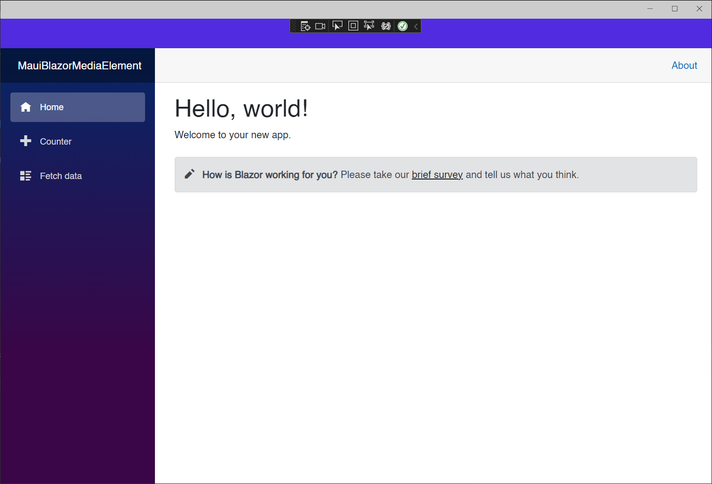

We can remove that by adding the following to *MainPage.xaml* on line 7:

```
NavigationPage.HasNavigationBar="False"
```

The entire *MainPage.xaml* should now look like this:

```xaml
<?xml version="1.0" encoding="utf-8" ?>
<ContentPage xmlns="http://schemas.microsoft.com/dotnet/2021/maui"
             xmlns:x="http://schemas.microsoft.com/winfx/2009/xaml"
             xmlns:local="clr-namespace:MauiBlazorMediaElement"
             x:Class="MauiBlazorMediaElement.MainPage"
             BackgroundColor="{DynamicResource PageBackgroundColor}"
             NavigationPage.HasNavigationBar="False" >

    <BlazorWebView x:Name="blazorWebView" HostPage="wwwroot/index.html">
        <BlazorWebView.RootComponents>
            <RootComponent Selector="#app" ComponentType="{x:Type local:Main}" />
        </BlazorWebView.RootComponents>
    </BlazorWebView>

</ContentPage>
```

Run it again, and you'll see there's no purple navigation bar at the top.

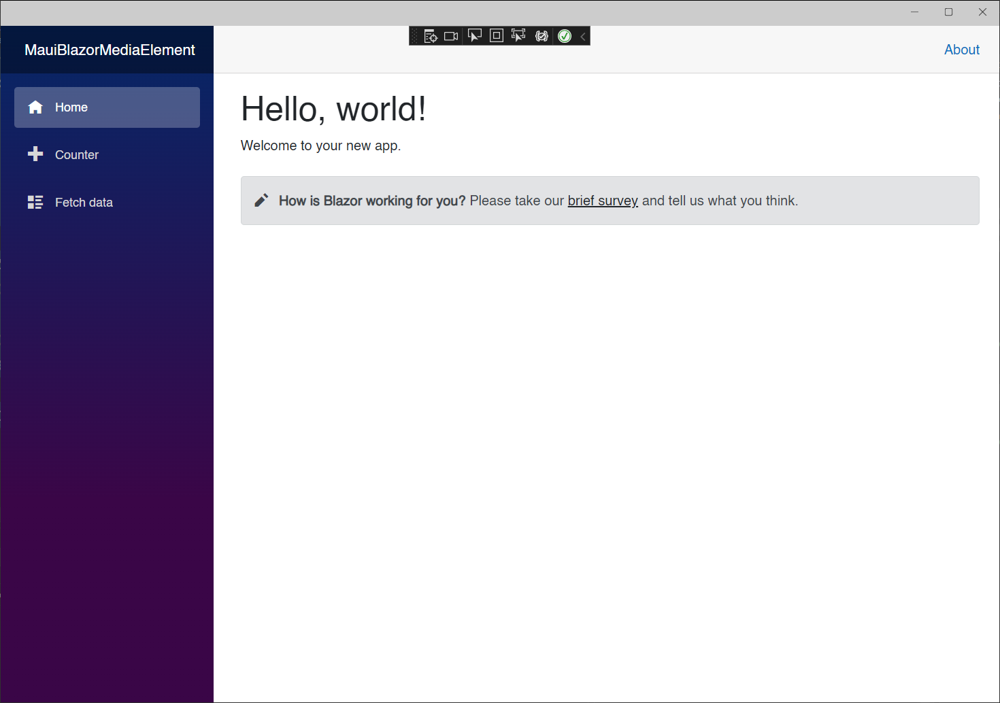

Now, go to the `Counter` page and press the button.

You'll see the media page, just like we saw in the Xaml app.

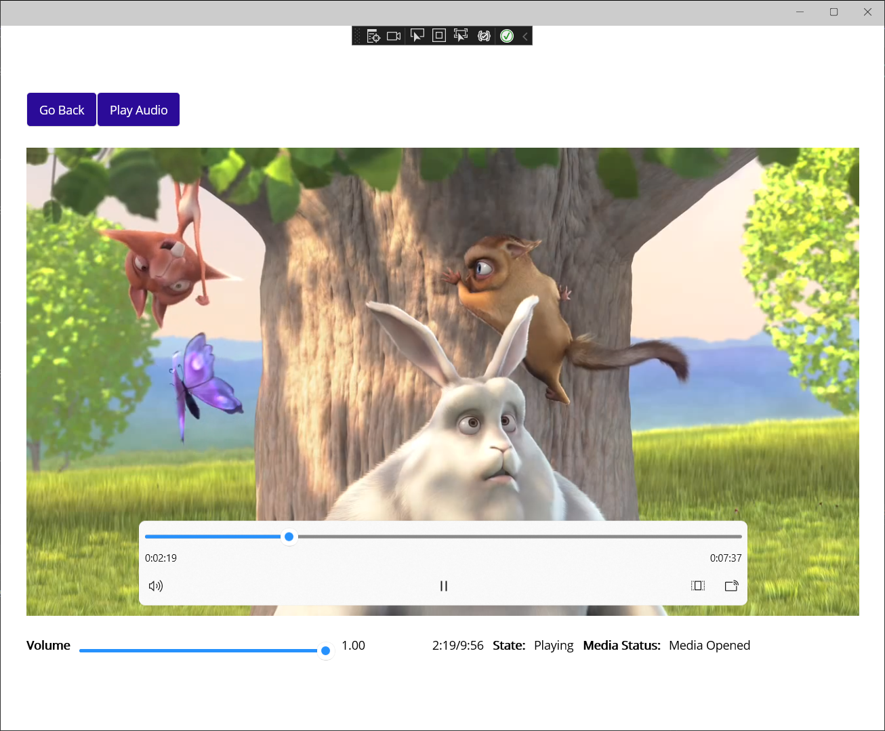

Click the **Go Back** button to return to the Blazor content.

## Summary

In this demo we looked at the **MediaElement** control in a **.NET MAUI** application. The **MediaElement** control provides a simple way to play audio and video files in a wide range of media formats, including MP3, WAV, OGG, MPEG, and many others, as well as media from URLs or embedded files.

We also learned how to play video and audio files, from a URL and embedded files. 

We also learned how to adjust the volume using the **Slider** control.

Finally, we learned that we can't directly add XAML controls to a Blazor page or component, but we can combine Blazor and XAML pages in the same MAUI app.

For more information about the **.NET MAUI MediaElement** control, check-out the resources below.

## Complete Code

The complete code for this demo can be found in the link below.

- <https://github.com/carlfranklin/MauiMediaElement>

## Resources

| Resource                                                               | Url                                                                                 |
| ---------------------------------------------------------------------- | ----------------------------------------------------------------------------------- |
| The .NET Show with Carl Franklin                                       | <https://www.youtube.com/playlist?list=PL8h4jt35t1wgW_PqzZ9USrHvvnk8JMQy_>          |
| Download .NET                                                          | <https://dotnet.microsoft.com/en-us/download>                                       |
| .NET Multi-platform App UI documentation                               | <https://docs.microsoft.com/en-us/dotnet/maui/>                                     |
| .NET Multi-platform App UI (.NET MAUI) Community Toolkit documentation | <https://learn.microsoft.com/en-us/dotnet/communitytoolkit/maui/>                   |
| MediaElement                                                           | <https://learn.microsoft.com/en-us/dotnet/communitytoolkit/maui/views/mediaelement> |
